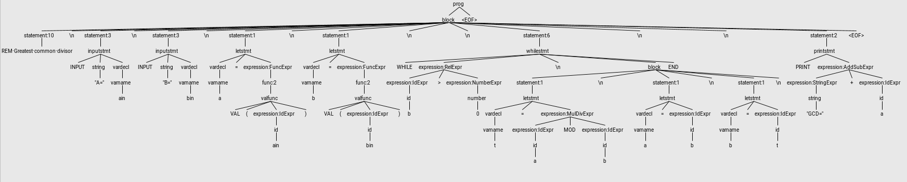

Getting started with parsing can be a bit daunting in the beginning. There's a lot of 
information to be digested before even a simple parser can be written.
This is yet another attempt to present the things in a simple and straightforward manner.
Since I very much believe in learning by doing let's just try to write a simple BASIC interpreter.

### The plan
Basically we need two things for our very simple interpreter:
* The parser. It's job is to consume a stream of character and create a higher level representation of
our program.
* The interpreter. It takes the higher representation produced by the parser and executes it.

### The tools
* A grammar. This defines the structure of our language.
* A parser generator. We'll use ANTLR. It's a popular tool and has good documentation and support.
We'll use it to generate a parser that can ingest a program with our own defined syntax.
* ANTLR plugin for Maven to make our life easy.

### Source code

You can find the Git repo for this article at [https://github.com/mateiw/littlebasic](https://github.com/mateiw/littlebasic).

### The language

BASIC comes in many variants. Since the goal here is just to play with ANTLR we'll just define our own very simple BASIC dialect. 

An simple program could be like this:

```
REM Greatest common divisor
INPUT "A=" ain
INPUT "B=" bin
a = VAL(ain)
b = VAL(bin)

WHILE b > 0
    t = a MOD b
    a = b
    b = t
END

PRINT "GCD=" + a
```

Although quite simple it should be enough to cover the basic (no pun intended) concepts.

### The grammar

To get started we have to to defined the grammar of our toy language. Like a human grammar this will define what words and sentences are acceptable in our language.
 
The very first thing we need is a the so called lexer grammar. This is responsible for breaking up the continuous stream of character that constitutes
our program into recognizable tokens like literals, strings, operators, etc. 

```antlrv4
lexer grammar LBTokens; // note "lexer grammar"

// operators
MUL : '*' ;
DIV : '/' ;
ADD : '+' ;
SUB : '-' ;
EXP : '^' ;
MOD : 'MOD' ;

// logical
NEQ : '<>' ;
GTE : '>=' ;
LTE : '<=' ;
GT  : '>' ;
LT  : '<' ;
EQ  : '=' ;

// relational
AND : 'AND' | 'and' ;
OR  : 'OR' | 'or' ;
NOT : 'NOT' | 'not' ;

// other
COMMA  : ',' ;
LPAREN : '(' ;
RPAREN : ')' ;

// functions
LEN : 'LEN' | 'len' ;
VAL : 'VAL' | 'val' ;
ISNAN   : 'ISNAN' | 'isnan' ;

// keywords
PRINT   : 'PRINT' | 'print' ;
INPUT   : 'INPUT' | 'input' ;
LET     : 'LET' | 'let' ;
REM     : 'REM' | 'rem' ;
IF      : 'IF' | 'if' ;
THEN    : 'THEN' | 'then' ;
ELSE    : 'ELSE' | 'else' ;
END     : 'END' | 'end';
FOR     : 'FOR' | 'for' ;
WHILE   : 'WHILE' | 'while' ;
REPEAT  : 'REPEAT' | 'repeat' ;
UNTIL   : 'UNTIL' | 'until' ;
STEP    : 'STEP' | 'step' ;
NEXT    : 'NEXT' | 'next' ;
TO      : 'TO' | 'to' ;
CONTINUE    : 'CONTINUE' | 'continue' ;
EXIT    : 'EXIT' | 'EXIT' ;

// comments
COMMENT : REM ~[\r\n]* ;

// literals
ID              : [a-zA-Z]+ ;  // match identifiers
NUMBER          : [0-9]+ ('.' [0-9]+)?;   // match integers
STRINGLITERAL   : '"' ~ ["\r\n]* '"' ;
DOLLAR          : '$' ;
NEWLINE         :'\r'? '\n' ;  // return newlines to parser (end-statement signal)
WS              : [ \t]+ -> skip ; // toss out whitespace
```

For the most part this is pretty self explanatory. 

The last part, the comments and literals, uses some more interesting tricks.

In case of the comments we want to keep things simple and only allow one lined comments. So we match any
 line starting with `REM` and any character up to newline. `~[\r\n]` means any character except `\r` or `\n`.
 
The numbers should be clear for those familiar with regular expressions. `[0-9]+ ('.' [0-9]+)?` means one ore more 
digits followed optionally by `.` and one or more decimals.

Since in our language the spaces and tabs are not significant we just want to ignore them, therefore
`[ \t]+  -> skip`. The `-> skip` statement is a lexer command that instructs Antlr to, well, skip to the next token.
 
Now, with the lexer grammar in place we can proceed to writing the parser grammar. The parser grammar will take the stream of 
tokens produced by the lexer grammar and will try to match them using the following rules.

```antlrv4
grammar LittleBasic;

// imports the other tokens and the grammar for expressions
import LBExpression, LBTokens;

// a programm is a block followed by an end-of-file
prog: block EOF; 

// the list of accepted statements
statement
    : letstmt
    | printstmt
    | inputstmt
    | ifstmt
    | forstmt
    | whilestmt
    | repeatstmt
    | continuestmt
    | exitstmt
    | COMMENT;

// a block is a list of statementes where each statement is followed by
// either a newline or the end of file
block
    : (statement (NEWLINE+ | EOF))*
    ;

// variable assignation. The LET keyword is optional here
letstmt
    : LET? vardecl EQ expression
    ;

// the name of the variable with an optional suffix
vardecl
    : varname varsuffix?
    ;

// the name of the variable must be a valid identifier
varname
    : ID
    ;

// the only acceptable suffix is the $ sign
varsuffix
    : DOLLAR
    ;

// PRINT expr
printstmt
    : PRINT expression;

// INPUT "something=" var
inputstmt
    : INPUT string vardecl
    ;

// IF expr
// THEN
// ... do smth
// ELSE
// ... something else
// END
ifstmt
    : IF expression NEWLINE* THEN NEWLINE+ block elifstmt* elsestmt? END
    ;

elifstmt
    : ELSE IF expression NEWLINE* THEN NEWLINE+ block
    ;

elsestmt
    : ELSE NEWLINE+ block
    ;

// FOR i = 1 TO 10 
//   .. do smth 
// NEXT
forstmt
    : FOR vardecl EQ expression TO expression (STEP expression)? NEWLINE+ block NEXT
    ;

// WHILE expr
//   .. do smth
// END
whilestmt
    : WHILE expression NEWLINE+ block END
    ;

// REPEAT
//  .. do smth
// UNTIL expr
repeatstmt
    : REPEAT NEWLINE+ block NEWLINE* UNTIL expression
    ;

// CONTINUE in FOR/WHILE
continuestmt
    : CONTINUE
    ;

// EXIT
exitstmt
    : EXIT
    ;

```

Again this should be self explanatory for the most part.

### Generating the parser

Since we're using Maven it's just a matter of using the [ANTLR plugin](http://www.antlr.org/api/maven-plugin/latest/index.html).
By default the plugin binds to the `generate-sources` phase of Maven lifecycle. It reads the grammar
 files from the `src/main/antlr4/basic` directory and then produces `.java` and `.tokens` files in the output directory
  `target/generated-sources/antlr4`. The generated Java files then become available in the build path.

```xml 
    <plugin>
        <groupId>org.antlr</groupId>
        <artifactId>antlr4-maven-plugin</artifactId>
        <version>4.6</version>
        <configuration>
            <libDirectory>${basedir}/src/main/antlr4/basic</libDirectory>
        </configuration>
        <executions>
            <execution>
                <id>antlr</id>
                <goals>
                    <goal>antlr4</goal>
                </goals>
            </execution>
        </executions>
    </plugin>
```

### The interpreter

With the parsing part now done it's time to execute our program. Generally there are two ways to approach the problem of
 executing a program. Either compile it into some executable form or use another program to intepret it.
  
For the sake of simplicity we'll use interpreter. Fortunately ANTLR already provides an API to help us with this task.

After the parsing is done, ANTLR produces a parse tree. As the name suggests it's a tree representation of the syntax of 
our program. In case of the example above it looks something like this:



Interpreting the code is a matter of walking the parse tree and executing some action for each statement that's encountered.

We're gonna use the `LittleBasicBaseVisitor<Value>` class generated by ANTLR. This class implements a `visit(tree)` method
 that pretty much does what the name suggests, namely visits each node of the given tree.

Additionally this class has callback methods that will be invoked for each node. By default these methods don't do anything
 but we're free to override them and plug in our own custom logic. To do this we'll simply extends this class:
 
```java

public class LittleBasicVisitor extends LittleBasicBaseVisitor<Value> {
    
    @Override
    public Value visitProg(LittleBasicParser.ProgContext ctx) {
        // ....
    }
        
    @Override
    public Value visitString(LittleBasicParser.StringContext ctx) {
        // ...
    }
    
    // ...
}
```

Now we can add here all our interpreter logic. Calling `LittleBasicVisitor.visit(tree)` will invoke our custom logic for
 each statement that is encountered by the visitor.
 
We won't go into the details of how the interpreter implementation. Just take a look at the `LittleBasicVisitor` class. Since it's just a toy interpreter the code should be
 quite self explanatory. 
 
### Putting it all together

Now that we have the grammars and the interpreter let's see how to make the various parts work together.

In the `Interpreter` class you'll find this code:

```java
    public Value run(InputStream progrIn) throws IOException {
        // wrap the input stream
        ANTLRInputStream input = new ANTLRInputStream(progrIn);
        // initialize the lexer with the input stream
        LittleBasicLexer lexer = new LittleBasicLexer(input);
        // initialize the tokens stream with the lexer
        CommonTokenStream tokens = new CommonTokenStream(lexer);
        // initialize the parser with the tokens stream
        LittleBasicParser parser = new LittleBasicParser(tokens);
        // set the error handling strategy
        parser.setErrorHandler(new BailErrorStrategy());
        // remove default error listeners
        parser.removeErrorListeners();
        // set our custom error listener
        parser.addErrorListener(new ErrorListener(stderrPrint));
        try {
            // parse the input into a parse tree
            ParseTree tree = parser.prog();
            memory = new Memory();
            // init our custom visitor
            LittleBasicVisitor eval = new LittleBasicVisitor(memory, stdin, stdoutPrint, stderrPrint);
            // visit the parse tree and interpret the program
            eval.visit(tree);
        } catch (InterpreterException e) {
            // handle interpreter errors
            stderrPrint.println(e.getMessage());
        } catch (ParseCancellationException e) {
            // handle parser errors
            if (e.getCause() instanceof InputMismatchException) {
                InputMismatchException inputEx = (InputMismatchException)e.getCause();
                String msg = Utils.formatErrorMessage(
                        inputEx.getOffendingToken().getLine(),
                        inputEx.getOffendingToken().getCharPositionInLine(),
                        "Syntax error");
                stderrPrint.println(msg);
            }
        }
        return null;
    }
```

Now we have a simple but fully functional Basic interpreter. Go ahead and build the project:

```bash
mvn install
```

and run it:

```bash
java -jar LittleBasic.jar /path/to/MyAwesomeProgram.bas
```

Enjoy!

 
 

 
